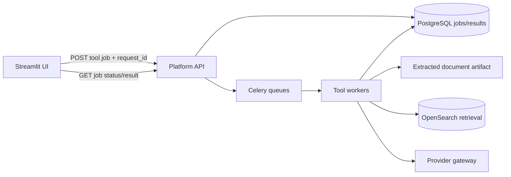

# AI-DOCUMENT-TOOLS-ENGINEERING-REVIEW-016

**التاريخ:** 2026-09-06  
**الفرع:** `conference-v1`  
**النطاق:** الملخص، الكيانات، الترجمة، التحليل، الخريطة الذهنية، البحث الأكاديمي  
**نوع العمل:** مراجعة هندسية وتشخيص فقط — لم تُنفذ إصلاحات  
**الحكم:** **NOT_READY_FOR_PRODUCTION**

> **خطة التنفيذ المقيّدة:** تم تحويل نتائج هذه المراجعة إلى مراحل وعقود واختبارات جاهزة للتنفيذ المتسلسل في `AI-DOCUMENT-TOOLS-TERRA-EXECUTION-PLAN-017.md`.

## الحكم التنفيذي

المحادثة تعمل عبر معمارية المنصة الجديدة: API، وظائف خلفية، عامل توليد، وحصر البحث بإصدار المستند. أما الأدوات الست الأخرى فما زالت تعتمد على المعمارية المحلية القديمة داخل Streamlit وعلى `st.session_state.rag_engine` و`last_full_text`.

السبب المباشر للعرض الخاطئ بأن كل مستند «صغير» هو أن قائمة الأرشيف تضع هذه العبارة مكان محتوى كل مستند:

```text
[مستند مفهرس سابقاً - اختره للمحادثة]
```

ثم تتعامل الأدوات مع العبارة باعتبارها النص الحقيقي. اختبار المتصفح الحي أثبت أن الملف `RAG_Test_Arabic_Document.pdf` ظهر في الترجمة والتحليل بحجم **37 حرفًا و6 كلمات**، بينما يحتوي OpenSearch فعليًا على مقطعين بإجمالي **3418 حرفًا**. لذلك الفهرسة ناجحة والمشكلة في طبقة استرجاع محتوى الأدوات.

يوجد عيب إضافي يجعل إصلاح شرط الـplaceholder وحده غير كافٍ: `get_file_content_safe()` يستطيع جلب النص فقط من `rag_engine` المحلي، وهذا المحرك غير مهيأ في مسار المنصة الطبيعي. كما أن API الحالي يعيد اسم المستند ومعرف الإصدار فقط، ولا يقدم النص المستخرج أو الصفحات. ومقاطع OpenSearch الحالية لا تحتوي ترتيب صفحة/مقطع صالحًا لإعادة بناء المستند الكامل بترتيبه الأصلي.

## الأدلة التي تم التحقق منها

| الدليل | النتيجة |
|---|---|
| حالة Docker Compose | Streamlit وAPI وعمّال الفهرسة والتوليد وPostgreSQL وOpenSearch وRedis وSearXNG كلها `healthy` |
| بيانات المنصة | مستند منشور واحد، إصدار مكتمل واحد، ووظيفتان |
| بيانات OpenSearch | مقطعان بطولي 1898 و1520 حرفًا للمستند نفسه |
| الترجمة من الملف في المتصفح | «صفحة تقريبية واحدة»، 37 حرفًا، 6 كلمات |
| التحليل في المتصفح | 6 كلمات، 37 حرفًا، 0 جملة، ومتوسط كلمة 6.2 |
| الكيانات السريعة | «لم يتم العثور على كيانات في النص» |
| الخريطة الذهنية | «النص قصير جداً أو فارغ» |
| الملخص | الضغط على «توليد الملخص» لا ينتج حالة نجاح أو خطأ، وزر تنزيل فارغ ظاهر قبل التوليد |
| البحث الأكاديمي | البحث الأساسي أعاد 10 نتائج دون أخطاء صفحة؛ توجد عيوب دقة واستمرارية موضحة أدناه |
| سجلات آخر 24 ساعة | لا توجد أخطاء API/فهرسة/توليد مرتبطة بهذه المشكلة؛ توجد أخطاء تحميل لمحركي SearXNG غير مستخدمين (`ahmia`, `torch`) |
| اختبارات الأدوات | لا توجد اختبارات وظيفية أو تكاملية للتبويبات الست |

## العيوب المشتركة الحرجة

### DT-P0-01 — تمرير الـplaceholder على أنه محتوى المستند

- **المكان:** `app_optimized.py:255-299` و`app_optimized.py:692-704`.
- **السبب:** كاشف النص البديل يتعرف على عبارة تبدأ بـ`[ملف مفهرس` فقط، بينما مسار المنصة يخزن عبارة تبدأ بـ`[مستند مفهرس`.
- **الأثر:** الملخص والكيانات والترجمة والتحليل والخريطة الذهنية تعمل على 37 حرفًا بدل المستند.
- **المطلوب:** منع تمثيل حالة المستند بنص قابل للمعالجة. يجب أن يكون الكاش كائنًا صريحًا بحالة `metadata_only/content_ready/error`، وأي أداة ترفض التشغيل ما لم يكن `content_ready=True`.
- **قبول الإصلاح:** لا يمكن لأي أداة تمرير placeholder أو رسالة نظام إلى محلل النص أو النموذج، مع اختبار آلي لكل صيغة حالة.

### DT-P0-02 — عدم وجود مصدر كامل ومرتب للنص والصفحات

- **المكان:** `backend/models.py:36-61`، `backend/api.py:325-351`.
- **السبب:** قاعدة البيانات تحفظ بيانات المستند والإصدار وحالة الفهرسة، ولا تحفظ artifact للنص المستخرج والصفحات. `/documents` يعيد الاسم والمعرفات فقط.
- **الأثر:** الأدوات التي تحتاج المستند كاملًا لا تستطيع العمل من جلسة جديدة أو بعد إعادة تشغيل التطبيق.
- **المطلوب:** أثناء الفهرسة، حفظ artifact ثابت لكل `document_version_id` في التخزين الدائم، مثل JSON مضغوط يحتوي `full_text` و`pages[]` و`page_number` و`char_count` و`checksum` و`extraction_method`. إضافة خدمة داخلية تقرأ artifact بالإصدار، مع endpoint آمن يعيد البيانات المطلوبة أو يشغّل الأداة عليها داخل العامل.
- **ملاحظة:** لا يُقبل جمع مقاطع OpenSearch الحالية مباشرة؛ بيانات الاختبار تحمل `document_id` و`document_version_id` لكنها لا تحمل ترتيب الصفحة أو المقطع، كما قد تحتوي المقاطع تداخلًا.
- **قبول الإصلاح:** فتح متصفح جديد واختيار مستند مؤرشف يعيد نفس عدد الصفحات والنص المستخرج وقت الفهرسة، دون إعادة رفع الملف.

### DT-P0-03 — الأدوات خارج بوابة وظائف الخلفية

- **المكان:** استدعاءات `rag_engine.llm.invoke()` المباشرة داخل `app_optimized.py:2311-2329`, `2482-2499`, `2664-2746`, `2833-2850`, `332-410`, `3113-3125`.
- **السبب:** لم تُنقل الأدوات إلى API وCelery مثل المحادثة.
- **الأثر:** طلب طويل يحجز جلسة Streamlit، والنتيجة تضيع عند refresh، ولا توجد مهلة أو إعادة محاولة أو إلغاء أو عزل ضغط عشرة مستخدمين.
- **المطلوب:** API موحد لإنشاء `tool_job` يحمل `tool_type`, `document_version_id`, options, `request_id`. ينفذ عامل التوليد/التحليل العمل ويحفظ التقدم والنتيجة والخطأ، وتعرض الواجهة الحالة عن طريق polling محدود.
- **قبول الإصلاح:** عشرة مستخدمين يشغلون أدوات مختلفة في الوقت نفسه دون تجميد الواجهة أو مشاركة النتائج، وتستعاد النتيجة بعد refresh.

### DT-P0-04 — غياب عقد موحد للتحقق والأخطاء

- **السبب:** بعض الأزرار لا تفعل شيئًا عند غياب المحرك، وبعض المسارات تعرض «النص صغير»، وبعضها يمسك كل الاستثناءات برسالة عامة.
- **المطلوب:** حالات موحدة: `document_not_ready`, `content_unavailable`, `provider_timeout`, `provider_rate_limited`, `invalid_output`, `search_unavailable`, `cancelled`. كل حالة لها رسالة عربية واضحة وإجراء إعادة محاولة مناسب ومعرف تتبع.
- **قبول الإصلاح:** لا يوجد زر ينتهي بصمت، ولا يُعرض خطأ «النص صغير» عندما يكون سبب المشكلة هو فشل تحميل المحتوى.

## مراجعة كل أداة

### 1. الملخص

| المعرف | الخطورة | العيب | التحسين المطلوب |
|---|---|---|---|
| SUM-01 | P0 | الزر لا ينفذ شيئًا في مسار المنصة لأن `rag_engine` يساوي `None`، ولا يوجد فرع خطأ للمستخدم. | تشغيل الملخص كـ`tool_job` مستقل وإظهار حالة واضحة دائمًا. |
| SUM-02 | P1 | نوع الملخص وطوله المعروضان في الواجهة لا يدخلان إلى دالة التوليد. | تعريف عقد options وربط `summary_type`, `summary_length`, `include_bullets` بالـprompt والتحقق من الناتج. |
| SUM-03 | P1 | الدالة تقص أول 8000 حرف فقط دون إعلام المستخدم أو تغطية بقية المستند. | تلخيص هرمي map/reduce بحسب tokens والصفحات ثم دمج موثق. |
| SUM-04 | P1 | الناتج متغير محلي يختفي مع أي rerun. | حفظ النتيجة وحالتها في Job/DB وربطها بالإصدار والخيارات. |
| SUM-05 | P1 | زر تنزيل ظاهر قبل وجود ملخص؛ الاختبار الحي أظهر ملف تنزيل 559 B دون نتيجة. | عدم إظهار التنزيل إلا بعد نجاح نتيجة غير فارغة، واختبار محتوى الملف. |
| SUM-06 | P2 | نسبة الضغط تقارن عدد الحروف وقد تصبح سالبة، بينما بقية المقاييس بالكلمات. | حساب نسبة الكلمات مع حصرها بين 0–100 ووسمها بدقة. |
| SUM-07 | P1 | لا توجد أدلة تمنع الهلوسة أو تربط النقاط بصفحات المصدر. | إرجاع citations/page references وفحص تغطية الأفكار وعدم إدخال معلومات خارج النص. |

**معايير قبول الملخص:** يعمل بعد جلسة جديدة، يحترم النوع والطول، يغطي كامل المستند، يحتفظ بالنتيجة بعد refresh، ويعيد مراجع الصفحات. يجب اختبار PDF عربي نصي، PDF ممسوح OCR، ومستند طويل لا يقل عن 50 صفحة.

### 2. الكيانات

| المعرف | الخطورة | العيب | التحسين المطلوب |
|---|---|---|---|
| ENT-01 | P0 | المسار السريع حلل عبارة الـplaceholder وأعلن عدم وجود كيانات. | تحميل artifact الصحيح والتحقق من جاهزيته قبل التحليل. |
| ENT-02 | P1 | `spacy.load("xx_ent_wiki_sm")` يحدث داخل كل ضغطة؛ استهلاك ذاكرة وزمن غير مناسب للتزامن. | تحميل النموذج مرة واحدة داخل worker/cache process-safe مع health check. |
| ENT-03 | P1 | التحليل السريع يقرأ أول 10000 حرف فقط دون تنبيه. | تقسيم كامل المستند، دمج وتوحيد الكيانات، وإظهار نسبة التغطية. |
| ENT-04 | P1 | النموذج متعدد اللغات العام ضعيف نسبيًا للعربية الأكاديمية، ولا توجد baseline جودة. | تقييم نموذج عربي مناسب أو pipeline هجين وقاموس مصطلحات، بقياسات Precision/Recall/F1 على fixture عربية. |
| ENT-05 | P1 | عند فشل spaCy تظهر رسالة «سيتم استخدام الطريقة البديلة» لكن الكود لا يشغل بديلًا. | تنفيذ fallback فعلي أو إزالة الوعد وتقديم زر إعادة المحاولة/LLM. |
| ENT-06 | P2 | تعرض تسميات خام مثل `PER/ORG` وعدد غير موحد وقد تتكرر الكيانات بصيغ متعددة. | تسميات عربية، normalization، deduplication، count، confidence، وصفحة الظهور. |
| ENT-07 | P1 | استخراج أقسام البحث يعمل محليًا على النص نفسه دون حراسة خطأ/حدود جودة. | وظيفة خلفية بإخراج JSON schema والتحقق من الأقسام والثقة. |

**معايير قبول الكيانات:** استخراج كل صفحات المستند، عدم تكرار الكيان نفسه بعد التطبيع، إظهار النوع والثقة والصفحات، fallback حقيقي، ونتائج ثابتة بعد refresh.

### 3. الترجمة

| المعرف | الخطورة | العيب | التحسين المطلوب |
|---|---|---|---|
| TRN-01 | P0 | الملف المؤرشف يتحول إلى صفحة وهمية من 3000 حرف؛ الاختبار أظهر 37 حرفًا وصفحة واحدة. | استخدام `pages[]` الحقيقية المحفوظة في artifact. |
| TRN-02 | P0 | إعادة رفع الملف لا تحل المشكلة في مسار المنصة، رغم أن الواجهة تطلب ذلك. | إزالة الرسالة المضللة وربط الفهرسة بحفظ الصفحات. |
| TRN-03 | P1 | «الحفاظ على التنسيق» خيار غير مستخدم في التنفيذ. | تطبيقه فعليًا بعقد إخراج يحافظ على العناوين والقوائم والجداول أو حذفه. |
| TRN-04 | P1 | فواصل قائمة اللغات عناصر قابلة للاختيار. | استخدام مجموعات عرض غير قابلة للاختيار والتحقق من `target_language`. |
| TRN-05 | P1 | التقسيم ثابت عند 800 كلمة، بلا token budget أو سياق مشترك، والتنفيذ تسلسلي داخل Streamlit. | chunking مبني على tokens والصفحات، سياق مصطلحات مشترك، Job قابل للاستكمال، وتزامن محدود مركزيًا. |
| TRN-06 | P1 | فشل جزء واحد يلغي العمل كله، ولا توجد إعادة محاولة لكل جزء أو استكمال. | حفظ نتائج المقاطع وتكرار الجزء الفاشل مع backoff ثم دمج ذري. |
| TRN-07 | P1 | النتيجة تضيع عند rerun ولا يوجد تقدير للمدة/التكلفة للمستند الكامل. | حفظ Job ونتيجته، وإظهار عدد الصفحات والمقاطع والتقدم الحقيقي قبل وأثناء التنفيذ. |
| TRN-08 | P2 | لا يوجد كشف لغة المصدر أو glossary أو فحص اكتمال. | كشف اللغة، قاموس مصطلحات ثابت للمستند، وفحص أن كل الصفحات ممثلة في الناتج. |

**معايير قبول الترجمة:** اختيار صفحة حقيقية أو نطاق أو كامل المستند؛ تقدم قابل للاستعادة؛ لا فقد للمقاطع عند timeout؛ اتساق المصطلحات؛ واحترام التنسيق عند تفعيله.

### 4. التحليل

| المعرف | الخطورة | العيب | التحسين المطلوب |
|---|---|---|---|
| ANL-01 | P0 | المقاييس تحلل الـplaceholder؛ لذلك ظهرت 6 كلمات و37 حرفًا و0 جملة. | تشغيل المقاييس على artifact الصحيح وربطها بإصدار المستند. |
| ANL-02 | P1 | حساب الجمل يعتمد على علامات محدودة، ومتوسط طول الكلمة يدخل المسافات ضمنيًا. | tokenizer عربي/متعدد اللغات، Unicode sentence boundaries، ومتوسط مبني على حروف الكلمات فقط. |
| ANL-03 | P1 | تكرار الكلمات دون تنظيف ترقيم أو تشكيل أو تطبيع ألف/ياء أو stopwords عربية. | pipeline تطبيع لغوي موثق مع خيار رؤية النص الخام. |
| ANL-04 | P1 | تحليل الموضوعات يقتطع أول/آخر 2000 كلمة فقط، ولا يوضح التغطية. | تحليل هرمي لكامل المستند مع نسب تغطية ومراجع صفحات. |
| ANL-05 | P1 | الواجهة تقول إن اختيار ملفات متعددة مناسب للمقارنة، لكن التنفيذ يعرض تحليلًا منفصلًا فقط. | إضافة مقارنة حقيقية أو تعديل الوصف؛ تحديد التشابه والفروق والموضوعات المشتركة بمخرجات موثقة. |
| ANL-06 | P1 | اختيار عدة ملفات يحمّل النصوص داخل جلسة Streamlit وقد يضاعف الذاكرة لكل مستخدم. | الحساب في worker، وإرجاع metrics/نتيجة مضغوطة فقط للواجهة. |
| ANL-07 | P2 | قسم توزيع الكلمات يصبح فارغًا للمستندات الصغيرة دون تفسير. | empty state واضح يشرح الحد أو عرض توزيع مناسب مهما كان الحجم. |

**معايير قبول التحليل:** أرقام لغوية صحيحة على corpus عربي معروف النتيجة، تغطية المستند كاملًا، مقارنة حقيقية عند تعدد الملفات، وعدم نمو ذاكرة Streamlit مع حجم المستند.

### 5. الخريطة الذهنية

| المعرف | الخطورة | العيب | التحسين المطلوب |
|---|---|---|---|
| MAP-01 | P0 | ترفض المستند الصحيح برسالة «النص قصير جداً أو فارغ» بسبب الـplaceholder. | جلب artifact الصحيح وتمييز فشل المحتوى عن قصره الحقيقي. |
| MAP-02 | P1 | `min_nodes` يمر إلى معامل اسمه `max_concepts`، والـprompt يثبت 7–12 فرعًا؛ الإعداد لا يحقق معناه. | تعريف `target_node_count` والتحقق من عدد العقد بعد التوليد مع repair محدود. |
| MAP-03 | P1 | يقرأ أول 6000 حرف فقط. | خريطة متعددة المراحل تغطي الأقسام/الصفحات ثم تدمج العلاقات. |
| MAP-04 | P1 | parser يقبل إخراجًا بلا headings ويرجع كائنًا ناجحًا بلا فروع. | JSON schema أو parser صارم؛ لا نجاح دون موضوع مركزي وعقد وروابط صالحة. |
| MAP-05 | P1 | اختيار `D3.js دائري` يدخل شرط Markmap نفسه، لذلك لا ينتج عرض D3 مستقلًا. | renderer مستقل لكل وضع واختبار DOM/صورة لكل اختيار. |
| MAP-06 | P1 | العرض والتصدير يعتمدان على CDN؛ الانقطاع أو CSP قد ينتج مساحة فارغة. | حزم محلية pinned مع fallback نصي ظاهر وحدث خطأ قابل للرصد. |
| MAP-07 | P2 | HTML المصدر يستخدم خلفية داكنة ثابتة تخالف الثيم الفاتح. | استخدام design tokens نفسها في العرض والتصدير. |
| MAP-08 | P1 | مفتاح الحفظ يعتمد على اسم الملف فقط و`direct_input` واحد، فلا يضم الإصدار أو الخيارات. | مفتاح `version_id + content_hash + options_hash + tool_revision`. |
| MAP-09 | P2 | يوجد مولد متقدم مستورد، بينما التطبيق يستخدم تنفيذًا مبسطًا مكررًا. | اعتماد implementation واحد وإزالة الازدواج بعد اختبارات التكافؤ. |

**معايير قبول الخريطة:** تغطية كل أقسام المستند، احترام عدد العقد، فشل واضح عند schema غير صالح، عمل Markmap وD3 وPlotly فعليًا، وعرض fallback دون إنترنت خارجي.

### 6. البحث الأكاديمي

البحث الأساسي يعمل الآن، لكنه غير جاهز كأداة بحث أكاديمية موثوقة.

| المعرف | الخطورة | العيب | التحسين المطلوب |
|---|---|---|---|
| WEB-01 | P1 | `WEB_SEARCH_AVAILABLE=True` يعني نجاح import فقط، و`is_available` يخزن أول نتيجة health إلى أجل غير محدد. | health TTL مع circuit breaker، وإعادة تحقق تلقائية بعد الفشل. |
| WEB-02 | P1 | تصنيف «ويكيبيديا» يرسل `general`؛ الاختبار الفعلي أعاد نتائج من `google cse` بدل ويكيبيديا. | تحديد محرك Wikipedia صراحة أو إزالة التصنيف. |
| WEB-03 | P1 | البحث «الأكاديمي» يعلن أربعة محركات ثابتة لكن النتيجة تعتمد على محركات SearXNG المتاحة؛ اختبار إنجليزي أعاد `pdbe`، واختبار عربي أعاد `google scholar` و`openairepublications`. | اكتشاف capabilities الفعلية، allowlist للمصادر العلمية، وإظهار المصادر التي استُخدمت بالفعل. |
| WEB-04 | P1 | اللغة ثابتة `ar` في استدعاء الواجهة حتى لو كان الاستعلام إنجليزيًا. | كشف لغة الاستعلام أو اختيار واضح وتمريره إلى الخدمة. |
| WEB-05 | P1 | النتائج متغير محلي وتختفي عند أي rerun؛ زر تحليل النتائج يعتمد كذلك على `rag_engine` المحلي. | حفظ البحث ونتائجه، وتشغيل التحليل كـtool job مستقل. |
| WEB-06 | P1 | لا توجد deduplication أو ترتيب موثوق حسب DOI/URL/العنوان أو تقييم لنوعية المصدر. | تطبيع DOI/URL، دمج التكرارات، وranking يراعي الصلة والتاريخ ونوع المصدر. |
| WEB-07 | P1 | نص نتائج الويب غير موثوق ثم يمر مباشرة إلى LLM؛ لا توجد حماية prompt injection. | فصل المحتوى عن التعليمات، sanitization، prompt isolation، وحدود حجم ومصدر. |
| WEB-08 | P2 | الاستعلام ذو المسافات فقط مقبول، والنجاح مع صفر نتيجة يعرض رسالة نجاح. | `strip()` وحد أدنى/أقصى، وحالة no-results مستقلة. |
| WEB-09 | P1 | طلب HTTP متزامن حتى 15 ثانية داخل Streamlit، بلا retry/backoff أو إلغاء. | خدمة/worker للبحث مع مهلة كلية، retries محسوبة، cache، وrate limit. |
| WEB-10 | P2 | لا توجد pagination حقيقية أو تحقق من بروتوكول الرابط. | pagination/cursor، وقبول `https/http` فقط قبل العرض. |
| WEB-11 | P2 | سجل SearXNG يظهر خطأ headers الخاصة بالعميل خلف proxy. | ضبط reverse proxy ليضيف `X-Forwarded-For`/`X-Real-IP` وفق trusted proxies. |

**معايير قبول البحث:** التصنيف يطابق المصدر، اللغة صحيحة، النتائج تبقى بعد rerun، لا تكرارات، المصادر قابلة للتتبع، التحليل محمي من محتوى الويب غير الموثوق، والخدمة تتعافى بعد توقف SearXNG وعودته.

## التصميم التنفيذي المقترح



1. **Artifact extraction:** اجعل ناتج OCR/الاستخراج أصلًا دائمًا مرتبطًا بإصدار المستند، مع ترتيب الصفحات والمقاطع.
2. **Document content service:** API داخلي يقرأ النص أو نطاق صفحات بالإصدار، مع checksum وحدود حجم وصلاحيات واضحة.
3. **Unified tool jobs:** إضافة أنواع `summary`, `entities`, `translation`, `analysis`, `mindmap`, `web_search`, `web_analysis` إلى نظام الوظائف الحالي.
4. **Result schemas:** مخرجات JSON versioned لكل أداة بدل Markdown حر فقط، مع نص عرض منفصل.
5. **Idempotency and caching:** مفتاح النتيجة من `tool_type + document_version_id + options_hash + tool_revision + model_revision`.
6. **Resource isolation:** queues منفصلة أو limits منفصلة للترجمة/التحليل الطويل والبحث، حتى لا تمنع المحادثات السريعة.
7. **Observability:** قياسات latency، queue wait، provider calls، tokens، retry count، completion rate، cancellation، وأخطاء حسب الأداة.

## خطة التنفيذ بالأولوية

### المرحلة A — إيقاف النتائج الكاذبة

- [ ] **A1 / P0:** استبدال placeholder النصي بحالة metadata صريحة.
- [ ] **A2 / P0:** تعطيل أزرار الأدوات برسالة «جاري تجهيز محتوى المستند» حتى يتوفر artifact صالح.
- [ ] **A3 / P0:** إضافة artifact النص الكامل والصفحات إلى مسار الفهرسة والتحقق من checksum.
- [ ] **A4 / P0:** إضافة migration/backfill للإصدارات المنشورة الحالية من الملف الأصلي، مع إعادة استخراج عند غياب artifact.
- [ ] **A5 / P0:** منع إعلان النجاح إذا كان الإدخال placeholder أو الناتج فارغًا/غير صالح.

### المرحلة B — نقل الأدوات إلى المنصة

- [ ] **B1 / P0:** تصميم API وDB contract لوظائف الأدوات والنتائج.
- [ ] **B2 / P0:** تنفيذ workers مع lease/heartbeat/deadline/cancel/retry الموجودة في نظام الوظائف.
- [ ] **B3 / P0:** ربط Streamlit بالوظائف مع polling محدود واستعادة بعد refresh.
- [ ] **B4 / P0:** عزل المستخدمين ونتائجهم مع إبقاء الأرشيف عامًا كما هو مطلوب.
- [ ] **B5 / P1:** تحديد concurrency لكل queue وفرض backpressure بدل تشغيل طلبات LLM داخل الواجهة.

### المرحلة C — صحة كل أداة

- [ ] **C1:** إصلاح عقد الملخص والتغطية والمراجع.
- [ ] **C2:** تحسين NER العربي، التحميل مرة واحدة، الدمج والثقة.
- [ ] **C3:** ترجمة بالصفحات، استكمال المقاطع، glossary والتنسيق.
- [ ] **C4:** مقاييس تحليل عربية صحيحة ومقارنة حقيقية.
- [ ] **C5:** schema وعروض مستقلة للخريطة وحزم محلية.
- [ ] **C6:** capabilities ودقة المصادر والحماية في البحث الأكاديمي.

### المرحلة D — إثبات الجودة والاستقرار

- [ ] **D1:** Unit tests لحالة المحتوى، التقسيم، الدمج، parsers، metrics، والبحث.
- [ ] **D2:** Contract tests بين Streamlit وAPI وworkers لكل نوع Job.
- [ ] **D3:** Browser E2E لكل تبويب باستخدام مستندات الاختبار.
- [ ] **D4:** اختبار عشرة مستخدمين متزامنين: محادثة + تلخيص + ترجمة + خريطة + بحث، مع تحقق العزل والاستعادة.
- [ ] **D5:** اختبارات أعطال: OpenRouter 429/timeout، restart للعامل، توقف SearXNG، refresh، وإلغاء وظيفة.
- [ ] **D6:** قياس الذاكرة والـCPU وزمن الانتظار وعدم وجود تسرب بعد دورة تحميل مستندات طويلة.

## مصفوفة ملفات الاختبار المطلوبة

| Fixture | الغرض |
|---|---|
| PDF عربي نصي قصير | صحة الأساس والاتجاه العربي |
| PDF عربي ممسوح OCR | الصفحات، الضوضاء، والثقة |
| PDF إنجليزي | كشف اللغة والترجمة والبحث |
| PDF مختلط عربي/إنجليزي | المصطلحات والـRTL/LTR |
| مستند 50+ صفحة | chunking، الاستكمال، الذاكرة، والتقدم |
| مستند جداول وعناوين وقوائم | الحفاظ على التنسيق |
| ملف فارغ/تالف/محمي | أخطاء الاستخراج الصحيحة |
| إصداران بالاسم نفسه ومحتوى مختلف | منع النتائج القديمة وخلط الكاش |
| نص يحاول prompt injection | حماية تحليل نتائج الويب والمستندات |

## بوابة القبول النهائية

لا يُعلن عن جاهزية الأدوات الست قبل تحقق الشروط التالية معًا:

- صفر نتيجة مبنية على placeholder أو إصدار قديم.
- كل أداة تعمل من جلسة متصفح جديدة على مستند موجود في الأرشيف العام.
- كل طلب له Job وحالة وتقدم ونتيجة أو خطأ قابل للتفسير، ويستمر بعد refresh.
- لا توجد استدعاءات LLM أو معالجة ثقيلة داخل عملية Streamlit.
- عشرة مستخدمين متزامنين يكملون السيناريوهات دون تجميد واجهة أو تسرب نتائج بين الجلسات.
- فشل مزود الذكاء أو SearXNG لا يسقط التطبيق ولا يضيع العمل المكتمل.
- نتائج الملخص والتحليل والخريطة تغطي المستند كاملًا وتربط الاستنتاجات بصفحات.
- اختبارات Unit وContract وE2E وConcurrency مضافة إلى CI وتنجح مرتين متتاليتين على بيئة نظيفة.
- مراقبة التشغيل تعرض معدل النجاح وزمن الانتظار والتنفيذ والأخطاء لكل أداة.

## ملاحظة أمنية منفصلة

مفتاح OpenRouter ظهر في سياق العمل داخل المحرر. يجب إلغاؤه وإصدار مفتاح جديد قبل أي نشر أو مشاركة إضافية، مع إبقاء `.env` خارج Git والسجلات. لا يتطلب ذلك تغيير منطق الأدوات لكنه إجراء عاجل لحماية الرصيد والخدمة.
