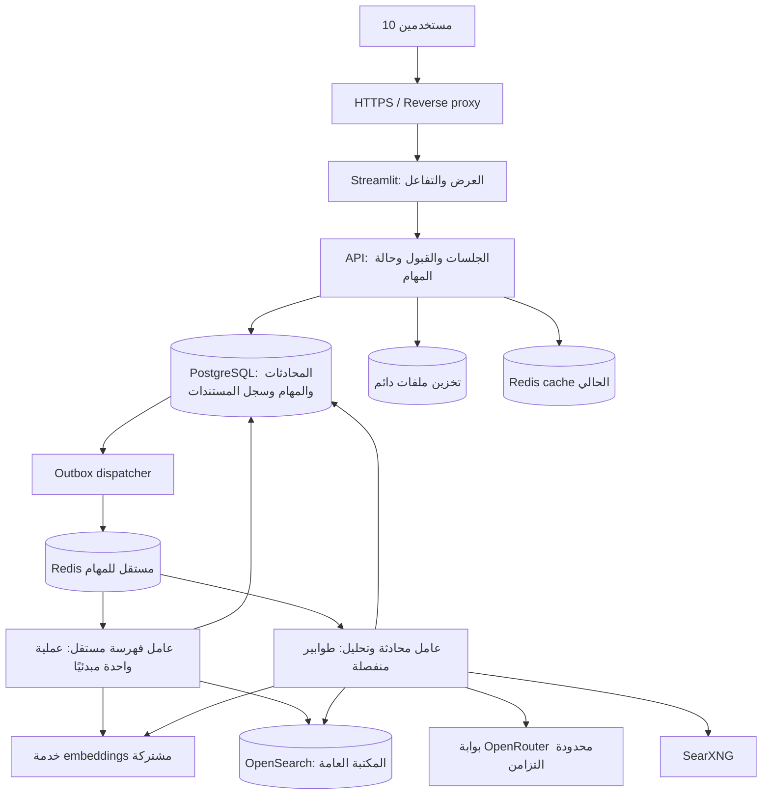

# الخطة الهندسية التنفيذية لاستقرار 10 مستخدمين متزامنين

التاريخ: 2026-09-05  
الحالة: خطة تنفيذ واختبار — ليست شهادة جاهزية أو نتيجة اختبار ضغط  
المرجع: الكود الحالي وتقارير UI-011 وINDEXING-STARTUP-012.

## 1. النتيجة المطلوب تسليمها

يدخل 10 مستخدمين ويستعملون الرفع والفهرسة والمحادثة في الوقت نفسه. تُقبل المهام
ضمن حدود معلنة، وتُنفذ بعدالة حسب الموارد؛ لا يمنع وجود مهمة فهرسة المستخدمين
الآخرين من إرسال مهامهم أو متابعة محادثاتهم.

الأرشيف مكتبة مشتركة: المستند المكتمل يظهر للجميع ويمكن للجميع البحث فيه.
المحادثة وتاريخها، السؤال الجاري، تفاصيل المهمة وإلغاؤها، وحالات الانتظار والخطأ
مستقلة لكل مستخدم. لا تتحول المكتبة إلى أرشيف خاص بكل شخص.

المقصود بعشرة مستخدمين متزامنين ليس تشغيل عشر عمليات OCR وعشرة نماذج محلية
دفعة واحدة. العدد المقبول والعدد المنفذ فعليًا إعدادان مختلفان، والطابور جزء
ظاهر من التجربة. استمرارية الخدمة لا تعني ضمان سرعة مزود خارجي في جميع الظروف.

## 2. أسباب التعديل في الكود الحالي

| الموضع | الوضع الحالي | التغيير المستهدف |
|---|---|---|
| `indexing_jobs.py` | منع فهرسة جديدة إذا وجدت أي مهمة نشطة | قبول مهام مستقلة وطابور محدود وعادل |
| `indexing_jobs.py` | Thread داخل Streamlit ومحرك محتفظ به لكل مهمة | عامل مستقل ومهام مستديمة وإزالة سجل المحركات غير المحدود |
| `engine_optimized.py` | نموذج embeddings مرتبط بكل engine | خدمة embeddings مشتركة محدودة السعة |
| `app_optimized.py` | تنفيذ المعالجة والطلبات الثقيلة في rerun | إرسال طلب قصير واستطلاع الحالة واسترجاع النتيجة |
| `openrouter_client.py` | مهلة وإعادة محاولة دون تنظيم مركزي للحمل | بوابة موحدة وحدود تزامن ومعدل وميزانية |
| `docker-compose.yml` | ملفات حتى 8192 MB وRedis cache بسياسة allkeys-lru | حدود رفع أصغر وRedis للمهام مستقل عن cache |
| المستندات | اختيار وتصفية باسم الملف | معرف مستند وإصدار مستقلان عن اسم العرض |
| حالة الجلسة | ذاكرة المتصفح/Streamlit هي المرجع | قاعدة بيانات للمحادثات والمهام؛ Session State للعرض فقط |

إصلاح حفظ نموذج embeddings على القرص يقلل إعادة التنزيل. مشاركة نموذج واحد
في الذاكرة وفصل التنفيذ خطوتان إضافيتان تحتاجان تنفيذًا مستقلًا.

## 3. المعمارية المقترحة

الاختيار المبدئي: FastAPI للواجهات الداخلية، Celery للعمال، PostgreSQL للحالة
الدائمة، وRedis broker منفصل. تشغيل نسخة Streamlit واحدة مبدئيًا يكفي كنقطة
بداية للاختبار؛ زيادة نسخ الواجهة ليست علاجًا لتكرار النموذج أو غياب الطابور.
إذا احتجنا نسخًا متعددة لاحقًا نضبط sticky sessions والرفع والوسائط خلف الموازن،
وفق [معمارية Streamlit الرسمية](https://docs.streamlit.io/develop/concepts/architecture/architecture).

نستخدم volume دائمًا للملفات على سيرفر واحد، مع واجهة تخزين قابلة للنقل إلى
object storage عند إضافة سيرفر آخر. لا تُرسل ملفات PDF أو النصوص الكبيرة داخل
رسائل Redis؛ تُرسل المعرفات ومراجع التخزين فقط.

## 4. ملكية الجلسات والمحادثات

- جلسة ضيف بمعرف عشوائي كامل وcookie موقعة أو حساب مستخدم إن كان مطلوبًا.
  الهوية يصدرها الخادم وتبقى بعد refresh؛ ليست قيمة `session_id` يختارها العميل.
- ربط conversation وmessage وjob بمالكها. كل قراءة/إلغاء لمهمة أو محادثة
  تتحقق من المالك على API. وجود `job_id` في الرابط ليس تصريح وصول.
- قراءة المستندات المنشورة عامة لجميع مستخدمي التطبيق، ولا يضاف فلتر مالك
  يمنع هذه المشاركة. الحذف الشامل والإدارة لا يكونان صلاحية لكل زائر.
- قيد فريد على `(conversation_id, client_request_id)` يمنع تكرار الرسالة عند
  rerun أو إعادة إرسال الشبكة، وطلب واحد جارٍ لكل محادثة يحافظ على ترتيب التاريخ.
- حفظ السؤال ونطاق المستند وإصداره عند القبول. تغيير اختيار المستخدم لاحقًا
  يؤثر على السؤال التالي، لا يبدل نطاق سؤال قيد التنفيذ.

## 5. البيانات والعقود التي تُنفذ أولًا

جداول PostgreSQL الأساسية:

| الجدول | الحقول/القيود الأساسية |
|---|---|
| sessions | id، token hash، created_at، expires_at |
| conversations | id، owner_id، title، created_at |
| messages | id، conversation_id، role، content، request_id، status، sources، timestamps |
| documents | document_id، display_name، content_hash، storage_key، original_available |
| document_versions | version_id، document_id، model_revision، chunking_version، status، expected_chunks، indexed_chunks |
| jobs | job_id، owner_id، type، payload_ref، state، attempt، heartbeat، deadline، result_ref |
| outbox | event_id، job_id، published_at، attempt |

عقود API المبدئية:

| العملية | النتيجة |
|---|---|
| `POST /uploads` | حفظ محدود الحجم وحساب hash؛ يعيد upload_id |
| `POST /indexing-jobs` | يعيد 202 وjob_id بعد حفظ المهمة بشكل دائم |
| `GET /jobs/{id}` | المرحلة والانتظار والوقت والتقدم للمستخدم المالك |
| `POST /jobs/{id}/cancel` | طلب إلغاء قابل للتحقق، دون التأثير على الآخرين |
| `GET /documents` | قائمة منشورة مشتركة، pagination وبحث |
| `POST /conversations/{id}/messages` | حفظ السؤال؛ يعيد 202 وrequest_id |
| `GET /conversations/{id}/messages` | رسائل المالك ونتائج طلباته |

يُكتب job وoutbox في transaction واحدة. إذا تعطل Redis بعد قبول الطلب، تظل
المهمة محفوظة ويعيد dispatcher نشرها. إعادة النشر لا تعني تنفيذ الأثر مرتين.

## 6. الفهرسة: دورة حياة قابلة للاستعادة

الحالات: `queued → preparing → extracting → embedding → indexing → completed`،
ومسارات `retry_wait / cancel_requested / cancelled / failed`.

1. التحقق من الملف والحدود، وكتابته مرة واحدة في تخزين دائم.
2. قبول المهمة وربطها بالمالك وإظهار عدد المنتظرين، دون نسبة تقدم مصطنعة.
3. عامل الفهرسة يسحب مهمة واحدة مبدئيًا. عند اكتمالها يحصل مستخدم آخر على دوره؛
   لا يستطيع مستخدم واحد حجز الطابور كله.
4. استخراج النص/OCR في process له حد ذاكرة وزمن؛ مهلة OCR توقف ذلك التنفيذ
   بأمان وتحرر العامل بدل ترك thread لا يمكن إنهاؤه.
5. إنشاء المتجهات بدفعات صغيرة عبر الخدمة المشتركة، مع أولوية لطلبات البحث.
6. فهرسة بمعرفات chunks حتمية من version_id ورقم المقطع، فتكون إعادة المحاولة
   upsert لنفس الأجزاء، لا مضاعفة لها.
7. فحص نتيجة كل عنصر في bulk قبل النجاح؛ نجاح HTTP لا يعني نجاح كل الأجزاء،
   كما توضح [وثائق OpenSearch Bulk](https://docs.opensearch.org/latest/api-reference/document-apis/bulk/).
8. نشر الإصدار في سجل المستندات بعد اكتمال كل أجزائه والتحقق من قابلية البحث.
   البحث يقبل فقط version_ids المنشورة في السجل؛ الأجزاء غير المكتملة لا تدخل
   إجابات «كل المستندات». تحديث هذا السجل يرفع archive_revision ويفسد cache المتأثر.
9. حفظ checkpoints بين المراحل. عامل مات تُستعاد مهمته بعد انتهاء lease، مع
   fencing token يمنع العامل القديم من نشر نتيجة بعد انتقال الملكية.

تسليم الطابور قابل للتكرار؛ لا نفترض exactly-once. نستخدم acknowledgments بعد
التنفيذ مع idempotency وإعداد prefetch مناسب للمهام الطويلة. تُضبط visibility
timeout وفق أقصى زمن مهمة وسياسة الاستعادة، وتُختبر حالات قتل العامل صراحة.
[مرجع Celery](https://docs.celeryq.dev/en/stable/userguide/optimizing.html).

الملفات بنفس الاسم لا تستبدل بعضها. نفس المحتوى ونفس إعدادات المعالجة يمكن
ربطهما بإصدار جاهز واحد؛ كل مستخدم يحتفظ بإيصال ومهمة مستقلين. تغير النموذج أو
chunking ينشئ إصدارًا جديدًا بدل استخدام نتيجة قديمة بصمت.

## 7. إدارة النموذج والردود والأدوات السبعة

خدمة embeddings تحمل النموذج مرة واحدة عند readiness، مع cache قرص دائم
وإصدار محدد. تحدد حجم الدفعة وطول المدخلات وعدد العمليات وthreads الداخلية
لتجنب استهلاك جميع الأنوية. تُعطى استعلامات المحادثة أولوية بين دفعات الفهرسة،
مع حد يمنع تجويع الفهرسة إذا استمرت الأسئلة.

بوابة generation واحدة تشمل المحادثة والتلخيص والترجمة والتحليل والخريطة
والكيانات المعتمدة على LLM وتحليل البحث. لا يبقى استدعاء مباشر في تبويب يتجاوز
هذه البوابة. إعادة صياغة السؤال تدخل في نفس حدود المزود وميزانية الطلب.

معالجة NLP/التحليل الثقيلة التي لا تستدعي LLM تُنفذ كذلك خارج عملية الواجهة
بحدود CPU وزمن؛ الواجهة تعرض النتائج والمخططات فقط. يُخزن النص المستخرج ومحتوى
الصفحات مرة واحدة ويُقرأ عند الحاجة؛ لا تُحمل نسخة الأرشيف كاملة في كل جلسة.
تُفصل dependencies والصور حسب دور الخدمة حتى لا تحمل الواجهة مكتبات النموذج
وOCR دون حاجة.

- كل الطلبات تشترك في حد عالمي، مع حد لكل مستخدم وعدالة بين المحادثات والتحليل.
- حد المعدل منفصل عن حد التزامن. يبدأ التشغيل بحدود منخفضة تُعاير مع الحساب
  والموديل؛ اشتراك الطلبات في مفتاح واحد ليس وحده سبب العطل.
- مهلة نهائية للطلب تشمل الانتظار والتنفيذ وإعادة المحاولة. retries محدودة مع
  تأخير متزايد وعشوائية، واحترام Retry-After إن أعاده المزود.
- توقف قبول التنفيذ مؤقتًا عند فشل المزود المتكرر، مع عرض الحالة وحفظ السؤال.
  لا يُعاد الطلب بلا سقف، ولا يُعرض الفشل كإجابة ناجحة قابلة للتخزين الطويل.
- cache الردود حساس لتاريخ المحادثة وإصدار المستندات والموديل وإعدادات التوليد؛
  يكون خاصًا بالمستخدم افتراضيًا. يمكن مشاركة cache استخراج النص والـembeddings
  للمستندات العامة. لا تُخزن رسائل فشل المزود ضمن cache الإجابات الناجحة.
- مفاتيح الخدمة تبقى على الخادم؛ logs تحتوي معرفات وتوقيتات وأكواد خطأ، لا
  مفاتيح أو نصوص محادثات كاملة افتراضيًا.

## 8. حدود تشغيل مبدئية قابلة للضبط

هذه قيم بدء للاختبار وليست سعة مُثبتة:

| البند | البداية المقترحة |
|---|---|
| مستخدمون نشطون مستهدفون | 10 |
| فهرسة ثقيلة تنفذ في الوقت نفسه | 1؛ ترفع إلى 2 بعد القياس فقط |
| pending indexing لكل مستخدم | 3 ملفات، ومجموع 100 MB |
| ملف PDF واحد | حتى 25 MB و100 صفحة؛ فحص الصفحات قبل المعالجة |
| طابور الفهرسة الكلي | 30 مهمة؛ الزيادة تُرفض بوضوح قبل اعتبارها مقبولة |
| إرسال رد واحد | طلب جارٍ واحد لكل محادثة ومستخدم افتراضيًا |
| generation في التنفيذ | 4 slots مبدئيًا، يوزعها scheduler بين الأنواع |
| generation قيد الانتظار | حتى 20؛ انتظار مستهدف لا يتجاوز 45 ثانية |
| embeddings | نموذج واحد، دفعات حتى 32 مقطعًا، حد tokens قبل القبول |
| متابعة المهمة | تحديث كل 2–3 ثوانٍ أثناء النشاط، أبطأ عند الخمول |

التجاوز يؤدي إلى 429 أو 503 مناسب ورسالة «السعة ممتلئة، حاول لاحقًا»، لا قبول
وهمي ثم فقدان للطلب. نجاح اختبار 10 مستخدمين يتطلب ألا تُرفض الطلبات داخل
سيناريو الحمل المتفق عليه بهذه الحدود.

طابور المهام يستخدم Redis مستقلًا بسياسة noeviction وAOF، مع إنذار قبل الامتلاء
ومعالجة فشل الكتابة. Redis الحالي يبقى للكاش بسياسة قابلة للإخلاء. مجرد استخدام
database رقم آخر في نفس Redis لا يفصل حد الذاكرة وسياسة الإخلاء. noeviction
يرفض الكتابة عند الامتلاء بدل حذف البيانات؛ لذلك تبقى قاعدة المهام وoutbox
مرجع القبول. [مرجع Redis](https://redis.io/docs/latest/develop/reference/eviction/).

## 9. السيرفر والنشر

مواصفات السيرفر الحالي غير معروفة. نقطة بدء مقترحة لبيئة اختبار كاملة: 8 vCPU،
32 GB RAM، وSSD لا يقل عن 100 GB مع احتساب حجم الأرشيف والنسخ الاحتياطية.
يمكن تقييم 16 GB بإعدادات أضيق، لكن لا يُعتمد تشغيل الإنتاج بناءً على التخمين.
هذه ليست مطالبة بشراء سيرفر قبل قياس الحالي.

توزيع أولي لميزانية الذاكرة على 32 GB: حتى 6 GB لـOpenSearch، و3 GB لاستخراج
النص/OCR، و2 GB لخدمة embeddings، و2 GB للواجهة، و3 GB لـAPI وعامل الردود،
و2 GB لـPostgreSQL، و1.5 GB لمجموع Redis، و1 GB للبحث/proxy/المراقبة. يبقى
الهامش للنظام والذاكرة المؤقتة والذروة. تُراجع RSS والـheap والـpage cache عمليًا؛
حد الحاوية ليس وعدًا باستهلاكها المعتاد ولا بديلًا عن ضبط داخل الخدمة.

نضبط CPU quotas، readiness بعد تجهيز النموذج، وliveness مستقلًا عن تعطل المزود،
وحجم الرفع والـWebSocket timeouts في reverse proxy. لا تُفتح قواعد البيانات
والـbroker ومفاتيح الإدارة للعامة.

سيرفر واحد مع restart وسياسة استعادة يتحمل تعطل عملية؛ لا يقدم high availability
عند تعطل الجهاز نفسه. الحاجة لاستمرار الخدمة أثناء فقدان السيرفر تتطلب مشروع
توافر منفصل ونسخًا احتياطية مجربة أو خدمات بيانات مُدارة.

## 10. مراحل التنفيذ والتسليم

| المرحلة | العمل القابل للمراجعة | شرط الخروج |
|---|---|---|
| 0 — القياس | RAM/CPU/القرص، logs وقت العطل، quotas، عينة PDF عربية | baseline وأهداف حمل مكتوبة |
| 1 — الهوية والحالة | API وPostgreSQL والجلسات وjobs/messages/outbox | استعادة محادثة ومهمة بعد refresh ومنع الوصول لمالك آخر |
| 2 — فصل الفهرسة | Celery وbroker مستقل وworker وcheckpoints/idempotency | قبول 10 مهام ونجاة الطابور من قتل العامل |
| 3 — الموارد والتوليد | خدمة embeddings والبوابة المركزية وتوصيل الأدوات السبعة | لا ينشأ نموذج لكل مستخدم، ولا استدعاء يتجاوز limits |
| 4 — الأرشيف والواجهة | document IDs/versions، نشر ذري منطقي، jobs UX | ملفات الجميع ظاهرة، حالات المهام والرسائل مستقلة |
| 5 — الضغط والفشل | اختبارات أدناه وقياس p95/RSS والعدالة | اجتياز أهداف القبول على السيرفر المستهدف |
| 6 — النقل | migration وتجربة rollback ونسخ احتياطي ومراقبة | ترقية تجريبية ثم 10 مستخدمين تدريجيًا |

تصحيح التقدير الزمني: رقم 17–24 يومًا في النسخة الأولى كان تقديرًا تقليديًا
لمشروع متكامل، ولم يكن مبنيًا على قياس زمن التنفيذ باستخدام Codex في هذا
المستودع؛ لذلك أزيل كموعد متوقع لهذا العمل. لا يُستبدل بضمان اكتمال خلال ساعتين.

يمكن اتخاذ ساعتين كنافذة تنفيذ أولى ونقطة تقييم: نستهدف خلالها معالجة أهم
اختناقات التزامن وإنتاج نسخة تجريبية قابلة للاختبار، مع تسجيل المنجز فعليًا
وما لم يكتمل. هذا هدف مبدئي وليس تأكيدًا لإنجاز جميع المراحل في هذه المدة،
ولا يلغي متطلبات الخطة أو يحوّل النسخة التجريبية إلى إصدار إنتاج معتمد.

اختبار الحمل المستمر المحدد أدناه يستغرق ساعة فعلية بعد تجهيز نسخة قابلة
للاختبار. اختبارات الأعطال والنشر والتصحيح تحتاج وقتًا إضافيًا؛ لذلك قد يتجاوز
التنفيذ الكامل والتحقق ساعتين. نحدّث التقدير من سرعة الإنجاز والنتائج المقاسة
بدل تحديد عدد أيام غير مسند أو وعد زمني قاطع قبل التنفيذ.

خريطة الملفات: يتحول `indexing_jobs.py` إلى واجهة قبول/حالة، وتنتقل المعالجة
إلى `workers/indexing.py`. يُفصل `engine_optimized.py` عن Session State وتُستبدل
إنشاءات embeddings المحلية بعميل `services/embeddings.py`. تصبح
`openrouter_client.py` حد التنفيذ الفعلي خلف `services/generation.py`.
يُختزل `app_optimized.py` إلى العرض وعميل API. تُضاف migrations، وعقود API،
واختبارات integration/load، وتعريفات الخدمات والـhealthchecks إلى Compose.

## 11. اختبار القبول: كيف نثبت أنه يخدم عشرة؟

بيئة الاختبار تسجل مواصفات السيرفر وإصدارات الصور والموديل وحالة cache. نستخدم
10 جلسات browser مستقلة لا 10 تبويبات بنفس cookies، مع اختبار API للحمل المستمر.
نبدأ بمزود تجريبي مضبوط التأخير والأخطاء لعزل backend، ثم اختبار حقيقي محدود
على OpenRouter. لا نستنتج نجاح المزود الحقيقي من اختبارات mock.

| السيناريو | التنفيذ | النجاح المطلوب |
|---|---|---|
| بداية متزامنة | 10 دخول ورفع PDF نصي حتى 20 صفحة/5 MB لكل واحد | 10 إيصالات مستقلة، بلا ضياع أو رفض داخل السعة |
| حمل مختلط | الـ10 يسألون أثناء فهرسة ملفاتهم | المحادثة تعمل، والانتظار ظاهر ومستقل |
| محادثة متواصلة | ساعة، 10 مستخدمين، سؤال جديد بعد اكتمال السابق و20–40 ثانية تفكير | لا OOM/restart؛ رصد العدد الفعلي للطلبات والأخطاء |
| OCR | ملفان مصوران ضمن الحد مع محادثات التسعة/العشرة | لا تجويع لطلبات البحث ولا تجمد للواجهة |
| أسماء متطابقة | محتويان مختلفان باسم واحد، وملف متطابق يرفعه اثنان | لا استبدال ولا خلط مصادر ولا مضاعفة غير مقصودة |
| عزل خاص/أرشيف عام | محاولات قراءة محادثة وإلغاء مهمة شخص آخر، وقراءة ملفه المنشور | منع الأولى والسماح بقراءة الأرشيف |
| انقطاع المتصفح | refresh وفصل الشبكة ثم العودة | استعادة الطلب دون تنفيذ/رسالة مكررة |
| قتل العامل | أثناء extraction وأثناء bulk وقبل publish | استعادة أو failure صريح؛ لا نشر جزئي ولا تكرار chunks |
| فشل الخدمات | Redis ممتلئ/متوقف، OpenSearch بطيء، 429/timeout من المزود | backpressure وإعادة محاولة محدودة وحالات مفهومة |
| التعافي | إعادة الخدمات | تصريف المهام المقبولة وعدم بقاء running زائف |

أهداف القبول المبدئية، على بيانات الاختبار المحددة:

- صفر فقدان لمهمة قُبلت بشكل دائم؛ كل مهمة تنتهي بنجاح أو فشل/إلغاء معلوم.
- صفر اختلاط محادثات أو نطاق سؤال، وصفر ظهور لإصدار فهرسة غير مكتمل.
- p95 لقبول job أو message أقل من ثانية، **بعد اكتمال نقل الملف**.
- p95 لقراءة حالة أو صفحة أرشيف أقل من ثانية، وانعكاس تغير الحالة في UI خلال 5 ثوانٍ.
- أقل من 1% أخطاء داخلية غير متوقعة في حمل الساعة؛ لا restart أو OOM.
- تحت مزود سليم: p95 للسؤال حتى الرد النهائي أقل من 120 ثانية، مع قياس
  queue wait وretrieval وprovider كل على حدة. لا نستبعد بطء المزود من تجربة
  المستخدم؛ إذا أخفق الهدف نعيد ضبط الحدود أو نراجع اتفاقية الخدمة.
- للدفعة النصية العشرية المحددة: هدف أولي اكتمال جميع الملفات خلال 5 دقائق
  بعد اكتمال الرفع، بعد تجهيز النموذج. OCR له baseline وهدف مستقل حسب الصفحات.
- RSS يستقر بعد warm-up؛ مقارنة نفس حالة الخمول بعد ثلاث دورات تحميل تكشف أي
  نمو مستمر. نحتفظ بهامش ذاكرة لا يقل عن 20% عند p95 للحمل.

نسجل: active sessions، عمق وعمر الطوابير، وقت الانتظار لكل مستخدم، heartbeat،
عدد retries، CPU/RSS، مساحة القرص، زمن embeddings، حالات OpenSearch، وأكواد
ومهل المزود. الإنذارات تبدأ قبل نفاد السعة؛ لا يكفي health endpoint يعيد ok.

## 12. نقل البيانات والتراجع

1. snapshot للفهرس ونسخة لملفات البيانات والإعدادات، وتجربة استعادة على staging.
2. إنشاء schema وفهرس جديد بإصدارات document_id/version_id، ونقل بيانات القديم
   مع مقارنة أعداد chunks والمصادر وعينة أسئلة عربية.
3. لا نفترض وجود PDF الأصلي لكل سجل قديم: المسار الحالي يحذف ملفات العمل بعد
   الفهرسة. نسجل `original_available=false` عند غياب الأصل، ونحافظ على إمكانية
   البحث في النص الموجود. لا نطلب إعادة رفع الجميع ولا ندعي استرجاع أصل مفقود.
4. انتقال عبر feature flag وواجهة توافق للفهرس الجديد. يمكن تبديل alias ذريًا
   عند جاهزية البيانات؛ [مرجع aliases](https://docs.opensearch.org/latest/api-reference/alias/aliases-api/).
5. قبل التحويل نوقف قبول فهرسة جديدة لفترة قصيرة ونصرف الطابور. نحفظ القديم
   read-only. عند التراجع نحتفظ بالملفات والمهام الجديدة ونصالحها، فلا تضيع
   عمليات قُبلت بعد التحويل أو تظهر لها رسائل نجاح غير صحيحة.
6. تشغيل تدريجي 2 ثم 5 ثم 10 مستخدمين مع نفس مقاييس القبول.

## 13. قرارات البداية والحدود

الخطة تحافظ على Streamlit والأرشيف العام والأدوات الحالية. إعادة تصميم الواجهة
من الصفر، Kubernetes، وزيادة عدد نسخ الواجهة ليست متطلبات البداية لعشرة مستخدمين.
قبل تحديد أرقام الإنتاج النهائية نحتاج RAM/CPU ونوع القرص وحجم الملفات المعتاد
ونسبة ملفات OCR وحدود حساب المزود. غيابها لا يمنع تنفيذ الفصل والمهام المستديمة،
لكنه يمنع اعتماد وعد قدرة نهائي.

تُسلّم التعديلات مع اختبارات قابلة لإعادة التشغيل، ونتائج تحميل مؤرخة، وسجل
ترقية وتراجع. لا تُعلن جاهزية عشرة مستخدمين قبل اجتياز هذا الاختبار على البيئة
المستهدفة. هذه الوثيقة لا تغيّر إعدادات الإنتاج أو تنفذ المعمارية تلقائيًا.
