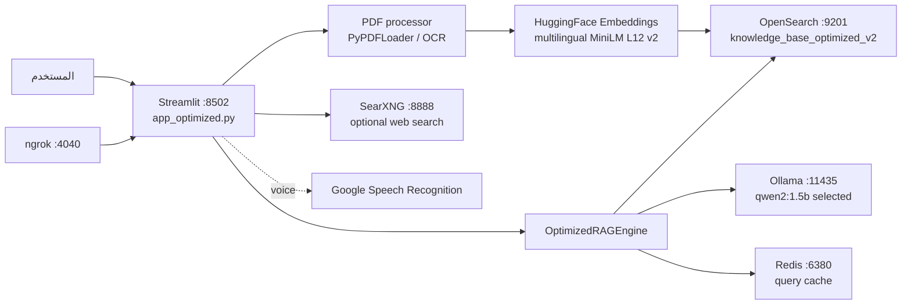
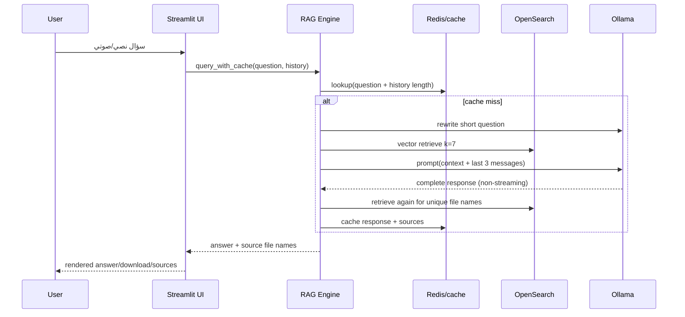

# AI-SYSTEM-SOURCE-DISCOVERY-002

**التاريخ:** 2026-09-04  
**النطاق:** تدقيق قراءة فقط لمصدر `F:\docker\files`. لم تُشغّل حاويات، ولم تُقرأ قيم `.env`، ولم يُعدّل كود التطبيق أو إعداداته.

## 0. التحقق من مساحة العمل

| بند | النتيجة |
|---|---|
| Current working directory عند بدء التدقيق | `F:\docker` |
| الشجرة العليا | `DockerDesktopWSL/`، `files/`، `دوكر البيانات/` |
| مستودع Git في `F:\docker` أو `F:\docker\files` | لا؛ لا يوجد `.git` / `git rev-parse` لم يرجع مستودعاً |
| مصدر التطبيق الفعلي | **`F:\docker\files`** |
| Compose | `F:\docker\files\docker-compose.yml` موجود |
| Frontend | موجود: `app_optimized.py` و`style.css` (Streamlit) |
| Backend/application logic | موجود: `engine_optimized.py`، `processor_optimized.py`، `utils.py` وغيرها |
| AI/RAG source | موجود: `engine_optimized.py` و`processor_optimized.py` |

هذا ليس `DockerDesktopWSL` ولا مجلد بيانات OpenSearch العربي؛ `files` يحوي ملفات Python المصدر وCompose وDockerfile. لا توجد بنية frontend/backend منفصلة أو REST API: هو تطبيق Streamlit أحادي العملية، يجمع الواجهة ومنطق التطبيق في Python.

## 1. شرح المنتج من منظور المستخدم

هذا **محرك بحث وتحليل أكاديمي محلي باللغتين العربية والإنجليزية**. يختار المستخدم نموذج Ollama، يفعّل المحرك، يرفع ملف/ملفات PDF، ويستطيع اختيار OCR للملفات الممسوحة. يستخرج النظام النص، يقسمه، ينشئ embeddings محلية، ويخزن القطع في OpenSearch. بعد ذلك يسأل المستخدم عن الملفات ويستلم إجابة مولدة من النموذج مع أسماء الملفات المصدرية. كما يقدم أدوات تلخيص، تحليل بحثي، NER، ترجمة، تحليل إحصائي، خرائط ذهنية، وبحث ويب اختياري عبر SearXNG.

### الشاشات/مسارات الاستخدام

لا توجد routes URL مستقلة؛ توجد صفحة Streamlit واحدة (`app_optimized.py`) مع sidebar و7 tabs:

1. **البحث والتحليل الذكي:** إدخال نص أو صوت ثم سؤال RAG في المستندات؛ يمكن تنزيل الجواب وعرض أسماء المصادر (`app_optimized.py:889-1050`).
2. **الملخص التلقائي:** اختيار ملف مفهرس حديثاً وتلخيصه (`:1355-1435`).
3. **استخراج الكيانات:** spaCy أو LLM أو مستخرج أقسام بحث مبني على قواعد (`:1438-1592`).
4. **الترجمة العلمية:** نص يدوي أو صفحات/كل ملف مرفوع؛ الترجمة عبر LLM (`:1595-1881`).
5. **تحليل النصوص:** إحصاءات وموضوعات مولدة من LLM (`:1884-1967`).
6. **الخرائط الذهنية:** ملف مرفوع أو نص مباشر، عرض Markmap/D3/Plotly وتصدير (`:1970-2160`).
7. **بحث الويب الأكاديمي:** طلب SearXNG ثم عرض النتائج؛ ويمكن تلخيص أول 5 نتائج بالـ LLM (`:2162-2242`).

رحلة أساسية: تفعيل المحرك من sidebar -> رفع PDF/اختيار تسلسلي أو متوازٍ وOCR -> فهرسة -> طرح سؤال في tab 1 -> استرجاع 7 قطع -> بناء prompt -> Ollama -> عرض جواب ومصادر. توجد أيضاً sidebar للأرشيف، health check، مسح cache، ومسح كامل فهرس OpenSearch، ونموذج support ticket.

## 2. الـ Full Stack

### الواجهة

- **Framework:** Streamlit، شرط الحزم `streamlit>=1.32.0`؛ لا يوجد React/Vue أو frontend مستقل.
- **الإصدار الفعلي:** غير مثبت lockfile؛ المتطلب الأدنى فقط، لذا الإصدار في image غير حتمي.
- **State:** `st.session_state` لجلسة المستخدم: المحرك، history، النصوص والصفحات، الملفات، إعدادات chunk، الخرائط وطابور شكلي (`app_optimized.py:130-156`). لا توجد جلسات خادمة آمنة متعددة المستخدمين.
- **API client:** لا توجد API داخلية. `requests` يستخدم فقط health checks وSearXNG؛ Streamlit يتحدث للمنطق مباشرة. `SpeechRecognition.recognize_google` يرسل الصوت إلى Google عند استخدام الإدخال الصوتي.
- **المظهر:** `style.css` وHTML عبر `unsafe_allow_html=True`.

### الخلفية والخدمات

- **Framework:** لا يوجد FastAPI/Flask/Django ولا API routes. نقطة التشغيل هي `streamlit run app_optimized.py` في Dockerfile.
- **المنطق:** `OptimizedRAGEngine` للـ RAG/OpenSearch/Ollama/cache؛ `OptimizedDocumentProcessor` للـ PDF/OCR؛ `WebSearchEngine` لـ SearXNG؛ `utils.py` للملفات/tickets/downloads.
- **Workers:** لا توجد Celery/RQ/queue دائمة. المعالجة داخل طلب Streamlit نفسه: حتى 4 ملفات متوازية (`processor_optimized.py:138-154`) وOCR للصفحات ضمن `ThreadPoolExecutor`، حتى `min(cpu_count*2,8)` (`:21-22, :68-75`).
- **قاعدة علائقية/ORM:** غير موجودة. البيانات الدائمة هي OpenSearch وRedis وملفات JSON/volumes.

## 3. Docker Compose الحقيقي

المصدر المرجعي هو `docker-compose.yml`، لا تقرير Docker السابق. عدد الخدمات: **6**.

| Service | Image/build | Host port -> container | Volume | memory/CPU limit | Depends on | Purpose |
|---|---|---|---|---|---|---|
| `streamlit-app` | build `Dockerfile`, `mysearchengine-app:latest` | `8502 -> 8501` | `./data:/app/data`, `app_stats:/app/stats` | لا limits CPU/RAM | OpenSearch/Ollama/Redis healthy، SearXNG started | الواجهة والمنطق |
| `ollama` | `ollama/ollama:latest` | `11435 -> 11434` | `ollama_data:/root/.ollama` | 4G limit، 2G reservation؛ CPU غير محدد | — | توليد LLM محلي |
| `opensearch` | `opensearchproject/opensearch:2.11.0` | `9201 -> 9200` | `opensearch_data:/usr/share/opensearch/data` | JVM 1G (`-Xms1g -Xmx1g`)؛ لا Compose memory/CPU limit | — | vector store/فهرس النصوص |
| `redis` | `redis:7-alpine` | `6380 -> 6379` | `redis_data:/data` | 512M limit، 128M reservation؛ CPU غير محدد | — | cache للاستعلامات |
| `searxng` | `searxng/searxng:latest` | `8888 -> 8080` | `./searxng:/etc/searxng:rw` | 512M limit، 128M reservation؛ CPU غير محدد | — | بحث ويب اختياري |
| `ngrok` | `ngrok/ngrok:latest` | `4040 -> 4040` | لا شيء | لا limits | Streamlit healthy | tunnel خارجي للتطبيق |

كلها على bridge network `nlp-network`. `deploy.resources` قد لا يُطبّق في Docker Compose غير Swarm بحسب implementation، فلا يعد ضماناً فعلياً للحدود. Compose ينشر منافذ **كل** الخدمات على المضيف، وليس فقط الواجهة.

## 4. تدفق المستند الكامل

```text
اختيار PDF من st.file_uploader (app_optimized.py:662)
  -> زر الفهرسة (685)
  -> OptimizedDocumentProcessor (688-691)
  -> tempfile .pdf من bytes (processor_optimized.py:83-88)
  -> فحص نص قابل للاختيار، أول 3-5 صفحات (41-53)
  -> PyPDFLoader للنص الرقمي + metadata source/type/method (55-64)
     أو pdf2image 150 DPI + Tesseract Arabic OCR (66-81)
     أو fallback OCR عند كشف نص مشوه (101-120)
  -> RecursiveCharacterTextSplitter، المقاس والتداخل المختاران (15-20,130)
  -> استدعاء ingest_documents_bulk (app_optimized.py:772-774)
  -> HuggingFace embeddings محلية أثناء vs.add_documents (engine_optimized.py:106-113,230-248)
  -> OpenSearchVectorSearch إلى knowledge_base_optimized_v2
  -> نجاح UI؛ النص الكامل يبقى في session فقط، والقطع/metadata في OpenSearch.
```

لا يوجد upload endpoint أو validation server-side مستقل: Streamlit يقيد اختيار الامتداد بـ PDF، لكن `utils.validate_pdf_file()` (يفحص الاسم والحجم وتوقيع `%PDF-`) **غير مستدعى** في مسار الرفع. لا يوجد حد Python لعدد الملفات/حجمها؛ حد Streamlit Compose هو 8192 MB. الملف الخام مؤقت فقط ويحذف في `finally` (`processor_optimized.py:135-136`)؛ لا يُحفظ في `/app/data`. النصوص والـchunks هي التي تحفظ عملياً في OpenSearch، والنص الخام فقط في ذاكرة الجلسة إلى أن تنتهي الجلسة.

## 5. تدقيق RAG

**الحكم: نعم، RAG فعلي أساسي، لكنه بسيط.** الدليل هو توليد embeddings للقطع وتخزينها في `OpenSearchVectorSearch` ثم `as_retriever(k=7)` وإدخال نتائج الاسترجاع في prompt قبل استدعاء LLM (`engine_optimized.py:214-223, 362-426`).

| عنصر | ما يثبته المصدر |
|---|---|
| chunk size / overlap | default class 1200/100، لكن UI يمرر فعلياً 2000/300 افتراضياً، ضمن 800-2000 و50-300 (`app_optimized.py:480-481,688-691`) |
| embedding model | `sentence-transformers/paraphrase-multilingual-MiniLM-L12-v2` (`engine_optimized.py:110-112`) |
| dimensions | 384 بعداً لهذا النموذج؛ لا يوجد assertion أو mapping صريح في المصدر |
| storage | OpenSearch index `knowledge_base_optimized_v2` (`:73`) |
| index mapping | **غير معرّف في المشروع**؛ ينشئه LangChain `OpenSearchVectorSearch` افتراضياً وقت أول add. لا يمكن إثبات حقوله النهائية من المصدر وحده. الاستخدام اللاحق يفترض `text`, `metadata.source.keyword`, `metadata.page` (`:465-492`). |
| similarity/algorithm | vector similarity عبر retriever الافتراضي لـ LangChain OpenSearch؛ لا توجد إعدادات `knn`, engine, space type أو hybrid query في source، لذا لا يمكن إثبات HNSW أو cosine من هذا المستودع |
| top-k | 7 (`:362`) |
| filters | لا filters في retrieval؛ يوجد term filter فقط عند جلب كل قطع ملف للعرض (`:476-492`) |
| reranking | لا؛ `flashrank` موجود كـ dependency لكنه غير مستورد/مستعمل |
| prompt assembly | `_format_docs` يضيف source/page/content؛ `build_prompt` يضيف context وآخر 3 رسائل (`:366-436`) |
| citations | تعرض الواجهة أسماء ملفات مصدرية فريدة فقط، حتى 5 (`app_optimized.py:1033-1047`)؛ لا citation داخل الجواب ولا mapping من ادعاء إلى page/chunk |

لا توجد keyword/BM25 أو hybrid search صريحة. OpenSearch هنا vector document store وليس محرك logs. عدم تعريف mapping هو مخاطرة تشغيلية/ترقيات.

## 6. تدفق المحادثة

`st.text_input` (أو نص Google speech-to-text) -> `query_with_cache()` (`app_optimized.py:981-1018`) -> key cache مبني من السؤال وطول التاريخ فقط (`engine_optimized.py:268-298`) -> يعيد صياغة السؤال القصير بالـ LLM (`rewrite_query`, `:341-353`) -> retriever يسترجع 7 وثائق باستخدام السؤال المعاد -> يبني prompt بالعربية/الإنجليزية والسياق وآخر 3 رسائل -> `self.llm` Ollama -> `StrOutputParser` -> يعيد response وأسماء المصادر -> HTML markdown و`st.chat_message`.

الاستجابة **غير streaming**: التنفيذ هو `.invoke()`؛ لا يوجد `.stream()` أو SSE/WebSocket API. كذلك الاسترجاع يحدث مرتين (ضمن chain ثم مرة ثانية لاستخراج source names، `:307-321`)، ما يزيد الكمون.

## 7. اقتران موفر LLM

**التصنيف: B — اقتران متوسط، قريب من hardcoded وظيفياً.** يوجد wrapper واحد (`OptimizedRAGEngine.llm`) وهو نقطة استبدال جيدة، لكن نوعه `langchain_community.llms.Ollama`، URL/fallbacks/health diagnostics وCompose كلها Ollama-specific، والـ UI يعطي قائمة نماذج Ollama.

كل نقاط الاستدعاء المباشر/الاعتماد:

- إنشاء `Ollama(...)` وإعداداته في `engine_optimized.py:116-143`.
- probes لـ `/api/tags` وفحص URLs Ollama في `engine_optimized.py:121-142,154-167`.
- Compose وDockerfile: `docker-compose.yml:21,51-76` و`Dockerfile:56,73-76`.
- كل التوليد يمر بـ `rag_engine.llm.invoke`: mind map (`app_optimized.py:259`)، chunk analysis (`416,431,454`)، NER (`1583`)، translation (`1837`)، topics (`1962`)، web summary (`2232`)، إضافة إلى rewrite/RAG/summary داخل engine (`:348,424,439`).

لدعم API خارجي يلزم: abstraction/config للprovider/model/credentials/timeouts، adapter متوافق مع LangChain أو واجهة `invoke`، حذف probes الخاصة بـ Ollama أو جعلها provider-aware، تعديل sidebar/health/Compose/README، سياسات retries/limits/cost/streaming، وإعادة اختبار كل أدوات LLM. **لا يلزم تغيير PDF أو OpenSearch أو embeddings** ما دام embedding provider الحالي محفوظاً. المخاطر: اختلاف context/tool/streaming/error semantics، وإرسال محتوى مستندات خاص إلى provider خارجي.

## 8. Embeddings

Embeddings **ليست Qwen ولا Ollama**. هي محلية عبر `HuggingFaceEmbeddings` والنموذج المحدد حرفياً `paraphrase-multilingual-MiniLM-L12-v2` (`engine_optimized.py:10,106-113`) وتتطلب `sentence-transformers` وTorch CPU. لذلك تبديل نموذج الدردشة أو Ollama لا يبدل embeddings ولا يعيد الفهرسة. أما تبديل نموذج embeddings نفسه فيتطلب إعادة embedding لكل البيانات ومراجعة mapping/dimension/index.

## 9. OpenSearch والبيانات

OpenSearch موجود لحفظ واسترجاع قطع الوثائق المضمّنة؛ كما يستخدم لعد الوثائق، عرض أسماء المصادر، وجلب النص المعاد تجميعه للعرض (`engine_optimized.py:455-492`). الاسم المعرف حالياً الوحيد هو `knowledge_base_optimized_v2`. لا schema/models علائقية، ولا index logs في الكود. `opensearch_data` volume هو الديمومة الحقيقية للـRAG؛ `app_stats` يحوي عدادات JSON، Redis cache فقط، و`./data` يحوي support tickets/download artefacts (وليس ملفات PDF الأصلية من ingestion).

## 10. ملف الموارد من المصدر

- 6 containers، نموذج Ollama واحد كحد أقصى محمل (`OLLAMA_MAX_LOADED_MODELS=1`)، توازي Ollama=2، keep-alive environment=5m. Wrapper LLM نفسه يرسل `keep_alive=10m`؛ التعارض غير موثق.
- LLM: context=8192، output cap=4096، temperature=.1، top_k=10، top_p=.95، repeat_penalty=1.1 (`engine_optimized.py:132-142`).
- OpenSearch JVM 1G؛ search queue 1000؛ لا CPU/RAM container limit محدد في compose.
- Redis maxmemory 512MB وLRU؛ TTL الافتراضي في cache 1800 s (`redis_cache.py:20-36`).
- ingestion batch 100-500، default UI=500؛ file parallelism=4؛ OCR images threads حتى 8 وpdf2image thread_count=2؛ OCR 150 DPI.
- لا queue durable/job status/retry workflow؛ لا worker processes Node أو Python مستقلة.
- upload cap configured 8192 MB؛ لا application validation/rate/concurrency limits.

## 11. تقييم الواجهة الحالية

الواجهة غنية وظيفياً ومهيأة للعربية وRTL في بعض المواضع، وتعرض progress أثناء الفهرسة، spinner أثناء الاستعلام، history، health، diagnostics، downloads، وإشعارات عند عدم تفعيل المحرك. التنقل Tabs واضح، لكن ليس product navigation متعدد الصفحات.

التقييم: **قابل للاستخدام كأداة demo/مشغل واحد، لكنه غير متماسك بما يكفي للإنتاج المشترك.** المشاكل البارزة: sidebar مزدحم، بعض خصائص التحليل لا تعمل على الملفات المسترجعة من index إلا عبر fallback، dark mode بالـHTML/JS غير موثوق، لا حالة processing دائمة أو استئناف، رسائل استثناء قد تظهر للمستخدم، ومخرجات LLM ونصوص PDF ترسم كـHTML غير مهرب. responsiveness تعتمد Streamlit/CSS ولم توجد اختبارات viewport. توجد تبعيات CDN للخرائط والصورة، فتناقض ادعاء "محلي بالكامل".

## 12. الأمن

| المجال | النتيجة |
|---|---|
| AuthN/AuthZ | **غير موجودين**؛ أي من يصل إلى Streamlit يشارك index والـcache وقد يمسح قاعدة البيانات |
| Upload | نوع PDF في UI فقط؛ `validate_pdf_file` غير مستخدم؛ cap ضخم 8GB؛ parsing/OCR على input غير موثوق |
| OpenSearch | security plugin معطّل، port 9201 منشور، credentials افتراضية في fallback source؛ خطر **حرج** إذا كان reachable |
| Ollama / Redis / SearXNG / ngrok | كلها منافذ منشورة؛ Ollama 11435 وRedis 6380 وSearXNG 8888 وngrok dashboard 4040. tunnel ينقل الواجهة إلى الخارج بدون طبقة auth في المصدر |
| CORS/XSRF | Dockerfile يمرر `--server.enableCORS=false` و`--server.enableXsrfProtection=false`؛ خطر مرتفع عند النشر المشترك |
| Secrets | `.env` مستثنى من Git، ولم تُفصح قيمه. لكن `.env` موجود محلياً وngrok token يمرر منه؛ لا secret-management أو rotation؛ Compose يتضمن defaults غير آمنة |
| Rate limits | لا توجد |
| Prompt injection | prompt يطلب استخدام السياق فقط، لكن لا يعزل المستندات كبيانات ولا sanitization/guardrails ولا تحكم أدوات؛ قابل لتعليمات خبيثة في PDF |
| XSS/HTML | نتائج LLM، text وكيانات تعرض عبر `unsafe_allow_html=True`؛ خطر XSS داخل واجهة مشتركة |
| subprocess | `ffmpeg` بقائمة args ثابتة وبدون shell، timeout 15s؛ جيد نسبياً، لكنه يستقبل صوت مستخدم. لا subprocess آخر في مسار التطبيق |
| data segregation | index واحد مشترك ولا user/tenant metadata/filters؛ لا خصوصية متعددة المستخدمين |
| egress | Google speech-to-text، SearXNG/الويب، Google Scholar links وCDNs؛ الادعاء "لا بيانات تخرج" غير صحيح عند استعمال الصوت/الويب/الخرائط |

## 13. تعليمات التشغيل الموجودة فعلاً

المصدر نفسه يذكر في `README.md:96-149`:

- Docker: `docker-compose up --build`، ثم فتح `http://localhost:8502`، ثم `docker exec ollama-optimized ollama pull qwen2:1.5b`.
- محلي: Python 3.11+، OpenSearch، Ollama، Tesseract OCR؛ ثم `pip install -r requirements.txt`، تشغيل OpenSearch/Ollama، `ollama pull qwen2:1.5b`، ثم `streamlit run app_optimized.py`.

هذه هي التعليمات **المدونة** وليست توصية تشغيل production. لاحظ عدم وجود Git repo محلي رغم أن README يفترض clone، وعدم pinning كامل للحزم، وعدم automation لتحميل model أو إنشاء mapping. لم تُشغّل هذه الأوامر ضمن التدقيق.

## 14. الاختبارات

- `test_project.py`: script يدوي من 5 مجموعات (syntax، imports، utilities، classes، وجود methods). ليس pytest، ولا fixtures أو mocks، ولا assertions end-to-end للـRAG أو security أو UI.
- `test_ingestion.py`: integration smoke test يتصل فعلياً بـOpenSearch ويعمل embedding/ingest؛ لم يُشغّل لأنه يغيّر index ويتطلب infrastructure.
- لم يُشغّل حتى test_project: لا يوجد Python interpreter usable على هذا المضيف (`Python was not found`)، ولا يجوز تثبيته في discovery-only. لذا لا توجد نتيجة تنفيذ للاختبارات.

**الحكم:** موجودة لكن محدودة وغير كافية لتأكيد تشغيل أو إنتاج.

## 15. الجاهزية للإنتاج

| المجال | التقدير | السبب المختصر |
|---|---|---|
| Frontend | RISKY | Streamlit UI جيدة للعرض لا لمستخدمين متعددين؛ HTML غير آمن |
| Backend | RISKY | لا API/auth/jobs؛ منطق وواجهة متداخلان |
| AI | ACCEPTABLE | إعدادات Ollama واضحة، لكن provider واحد وبدون observability/cost/robust retry |
| RAG | ACCEPTABLE | retrieval حقيقي، لكنه لا mapping explicit/rerank/filters/citations دقيقة |
| Security | CRITICAL | منافذ مكشوفة، OpenSearch بلا security، لا auth، XSRF معطل، ngrok |
| Deployment | RISKY | Compose مفيد محلياً؛ images latest/no pins، limits ناقصة، docs متضاربة |
| Monitoring | RISKY | health checks وعدادات بسيطة فقط؛ لا logs/metrics/alerts مركزة |
| Error handling | RISKY | catches كثيرة broad وبعضها يخفي الأخطاء؛ لا queue/recovery |
| Performance | RISKY | caching/concurrency موجودان، لكن double retrieval و8GB uploads وOCR in-process |

## 16. أثر التغيير (دون تنفيذ)

| الخيار | ملفات/مناطق تتأثر | المخاطر والتعقيد | المجهول |
|---|---|---|---|
| A. الإبقاء على local Qwen/Ollama | Compose/Docker/README وعمليات النشر فقط | منخفض، لكن أمن التشغيل **حرج** قبل shared server | الموارد الواقعية للنموذج وحمل المؤتمر |
| B. external API للتوليد فقط | `engine_optimized.py`، `.env`/Compose، `app_optimized.py` diagnostics/model picker، README/tests | متوسط؛ credentials/egress/privacy/streaming وadapter | limits، costs، المنطقة والاحتفاظ بالبيانات عند provider |
| C. local + external providers | provider interface/config/DI + كل call sites وUI/health/tests/deployment | عالٍ؛ حالات فشل وفروق capabilities؛ policy لاختيار provider | UX المرغوب، failover، model catalog، privacy policy |
| D. redesign frontend مع حفظ backend | غالباً فصل `app_optimized.py` إلى API/service وfrontend جديد؛ CSS/UX/state/auth | عالٍ؛ لا backend API قائم يعاد استخدامه مباشرة | framework، roles، deployment topology، realtime/streaming requirements |

## 17. خريطة المعمارية

### الوضع الحالي



### مسار طلب RAG



## 18. ملخص قائد الفريق

- **ما هو النظام؟** أداة Streamlit للبحث في ملفات PDF الأكاديمية وتحليلها محلياً، مع إضافات ترجمة/تلخيص/NER/خرائط/بحث ويب.
- **كامل أم prototype؟** prototype متقدم أو demo وظيفي، وليس جاهزاً كمنصة shared production.
- **كيف يعمل AI؟** Ollama يولد الإجابات والتحليلات والترجمات؛ HuggingFace MiniLM ينشئ embeddings مستقلة.
- **هل هو RAG حقيقي؟** نعم: chunks -> embeddings -> OpenSearch vector retrieval -> context prompt -> LLM. لكنه RAG أساسي بلا reranking/hybrid/filters/citations صفحية موثقة.
- **لماذا OpenSearch؟** مخزن متجهات وقطع نصوص، لا logs ولا قاعدة علائقية.
- **ما الذي يرفع وأين يخزن؟** PDF فقط في UI؛ raw PDF temp يحذف، chunks/text/metadata تحفظ في OpenSearch volume؛ session text في RAM؛ tickets/downloads في bind-mounted `data`.
- **كيف يفهرس؟** استخراج رقمي أو OCR -> `RecursiveCharacterTextSplitter` -> MiniLM embeddings -> `OpenSearchVectorSearch.add_documents`.
- **كيف يعمل chat؟** يعيد صياغة السؤال القصير، يسترجع 7 chunks، يركب prompt بالسياق/history، ويستدعي Ollama synchronously؛ يعرض أسماء ملفات فقط كمصادر.
- **هل Ollama سهل الاستبدال؟** ليس ضغطة إعداد، لكنه قابل للتنفيذ بتعقيد متوسط لأن معظم التوليد خلف `rag_engine.llm`. يلزم provider abstraction وتعديل deployment/health/UI/config/tests.
- **هل تغيير LLM يغير embeddings؟** لا؛ embeddings نموذج HuggingFace آخر. تغيير embedding model هو تغيير منفصل ويتطلب re-index.
- **أكبر الديون:** غياب auth/multi-tenancy/API/jobs، surface network مكشوف، XSRF/CORS setting غير آمن، mapping/RAG governance غير صريحة، dependencies غير pinned، UI/logic monolith، اختبارات ضعيفة، ووثائق متأخرة (مثلاً index/search-k وذاكرة الخدمات تختلف عن source).
- **ما يجب إصلاحه قبل المؤتمر؟** أولاً العزل الشبكي وإلغاء تعريض OpenSearch/Redis/Ollama/SearXNG/ngrok أو تأمينها، authentication/authorization، TLS/reverse proxy، منع destructive database action عن المستخدمين، upload validation/limits، XSS/prompt-injection controls، secrets، backup/restore/monitoring، واختبار load وrecovery. لا يعتبر مناسباً لخادم مشترك قبل ذلك.
- **ما الذي لا ينبغي لمسه الآن؟** لا تعِد فهرسة `opensearch_data` ولا تغير embedding model/index mapping أو تحذف index/volumes؛ ولا تبدل Ollama قبل snapshot واختبار استرجاع، لأن ذلك قد يفقد corpus المفهرس أو يجعل vectors غير متوافقة.

## حدود الدليل

هذا تقرير source code فقط. لم تُفتح بيانات VHDX أو volumes، لم تُعرض أسرار `.env`، ولم تعمل الخدمات. لذلك حالة الـmodels المحملة فعلياً، mapping المنشأ فعلياً، ومحتويات indices لا يمكن إثباتها هنا؛ القيم السابقة عن qwen2:1.5b/GGUF تخص التحقيق الجنائي المذكور من المستخدم، بينما المصدر الحالي يسمح باختيار عدة نماذج ويستخدم `llama3` كـconstructor default.
